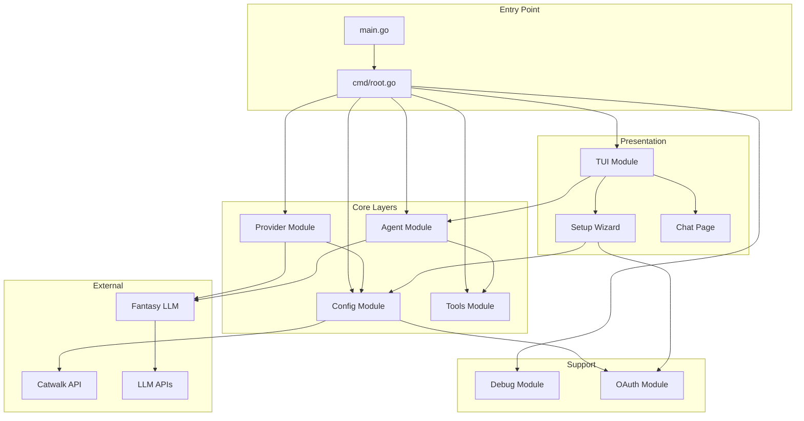
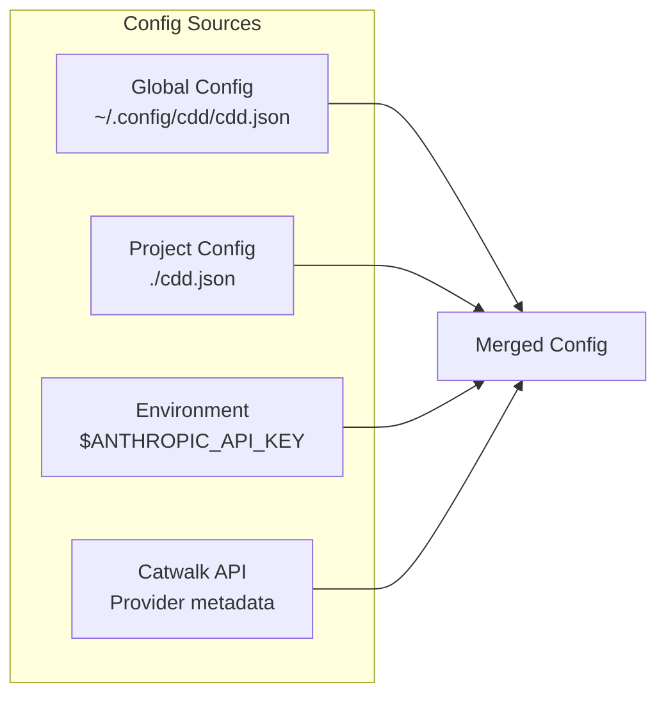
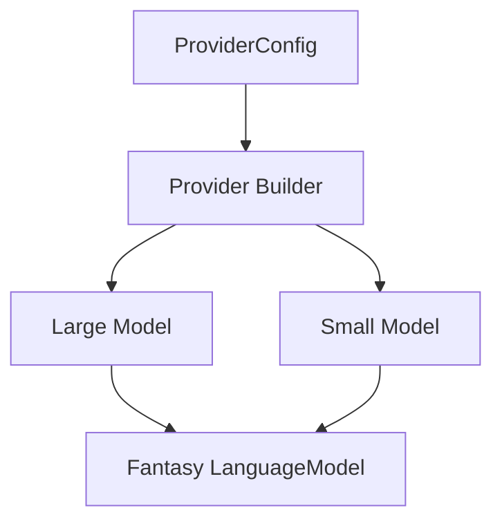
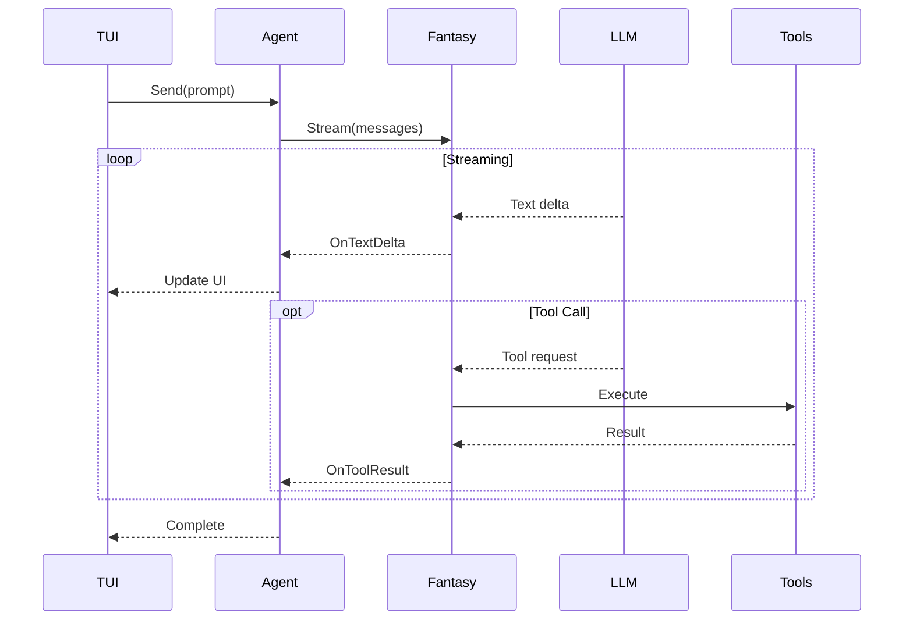
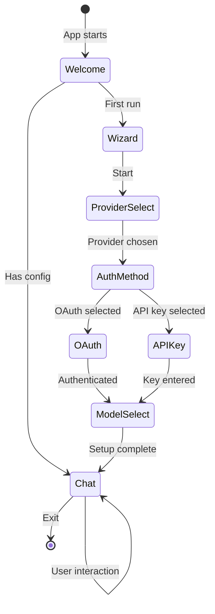
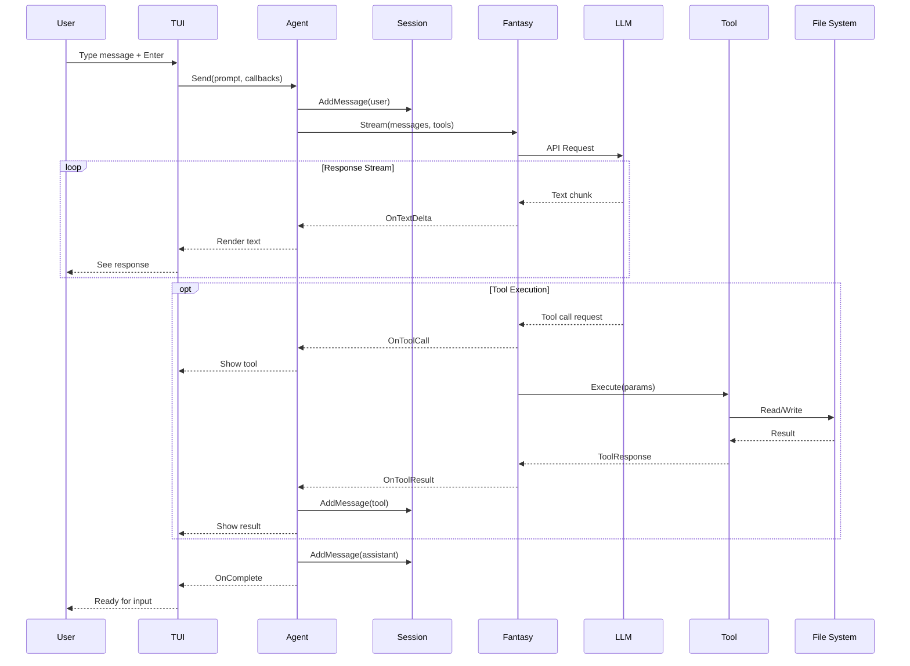
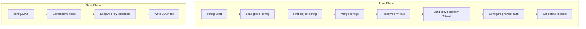

# CDD Contributor Onboarding Guide

Welcome to **CDD (Context-Driven Development)** - an AI-powered CLI coding assistant built with Go.

This guide provides a comprehensive overview of the codebase architecture, data flow, and design decisions to help you become a productive contributor.

---

## Table of Contents

1. [Project Overview](#project-overview)
2. [Architecture](#architecture)
3. [Layer Deep Dive](#layer-deep-dive)
4. [Data Flow](#data-flow)
5. [Key Concepts](#key-concepts)
6. [Getting Started](#getting-started)
7. [Development Workflow](#development-workflow)
8. [Documentation Index](#documentation-index)

---

## Project Overview

CDD is a terminal-based AI coding assistant that helps developers write, understand, and improve code through natural language interaction.

### Key Features

| Feature | Description |
|---------|-------------|
| Multi-Provider Support | Works with Anthropic (Claude), OpenAI, and compatible APIs |
| Two-Tier Model System | Uses "large" models for complex tasks, "small" for quick operations |
| Rich Terminal UI | Built with Bubble Tea for a modern terminal experience |
| Tool Integration | File operations, code search, and shell execution |
| OAuth Support | Claude account authentication with token refresh |
| Configuration Layers | Global + project-specific configuration |

### Tech Stack

| Component | Technology |
|-----------|------------|
| Language | Go 1.25 |
| CLI Framework | [Cobra](https://github.com/spf13/cobra) |
| TUI Framework | [Bubble Tea v2](https://github.com/charmbracelet/bubbletea) |
| Styling | [Lip Gloss v2](https://github.com/charmbracelet/lipgloss) |
| LLM Orchestration | [Fantasy](https://charm.land/fantasy) |
| Provider Metadata | [Catwalk](https://github.com/charmbracelet/catwalk) |
| Markdown Rendering | [Glamour](https://github.com/charmbracelet/glamour) |

---

## Architecture

### High-Level Overview



### Package Structure

```
cdd/
├── main.go                    # Application entry point
├── cmd/                       # CLI commands (Cobra)
│   ├── root.go               # Root command, initialization
│   └── version.go            # Version subcommand
├── internal/                  # Private packages
│   ├── agent/                # AI agent orchestration
│   ├── config/               # Configuration management
│   ├── debug/                # Development logging
│   ├── oauth/                # OAuth2 authentication
│   │   └── claude/           # Claude-specific OAuth
│   ├── provider/             # LLM provider abstraction
│   ├── tools/                # Agent tools (read, write, etc.)
│   └── tui/                  # Terminal user interface
│       ├── components/       # Reusable UI components
│       │   ├── logo/         # ASCII logo
│       │   ├── welcome/      # Welcome screen
│       │   └── wizard/       # Setup wizard steps
│       ├── page/             # Page-based navigation
│       │   └── chat/         # Chat interface
│       ├── styles/           # Theme and styling
│       └── util/             # TUI utilities
└── docs/                      # Documentation
    ├── cmd-layer.md          # CMD layer docs
    └── features/             # Feature documentation
```

---

## Layer Deep Dive

### 1. CMD Layer (Entry Point)

**Location:** `cmd/`
**Documentation:** [cmd-layer.md](./cmd-layer.md)

The CMD layer is the application entry point built with Cobra. It orchestrates the startup sequence:

```
User runs: cdd [--debug]
     │
     ▼
┌─────────────┐
│  Execute()  │  Entry point
└──────┬──────┘
       │
       ▼
┌─────────────────────────────────────────────────────┐
│                    runTUI()                          │
├─────────────────────────────────────────────────────┤
│ 1. Enable debug logging (if --debug)                │
│ 2. Check first run status                           │
│ 3. Load configuration                               │
│ 4. Load providers from Catwalk                      │
│ 5. Create agent (if not first run)                  │
│ 6. Create agent factory for hot-reload              │
│ 7. Launch TUI                                       │
└─────────────────────────────────────────────────────┘
```

**Key Responsibilities:**
- Parse CLI flags (`--debug`)
- Coordinate initialization sequence
- Handle graceful error recovery
- Launch TUI with all dependencies

---

### 2. Config Module

**Location:** `internal/config/`
**Documentation:** [features/config-module.md](./features/config-module.md)

Manages configuration from multiple sources with environment variable resolution.



**Key Types:**
- `Config` - Top-level configuration container
- `ProviderConfig` - Provider authentication (API key, OAuth)
- `SelectedModel` - Model selection for large/small tiers

**Key Functions:**
- `Load()` - Load and merge configuration
- `Save()` - Persist configuration
- `IsFirstRun()` - Detect first-time setup

---

### 3. Provider Module

**Location:** `internal/provider/`
**Documentation:** [features/provider-system.md](./features/provider-system.md)

Abstracts LLM provider instantiation using Fantasy and Catwalk.



**Two-Tier System:**
| Tier | Purpose | Example Models |
|------|---------|----------------|
| Large | Complex reasoning, code generation | Claude Opus, GPT-4 |
| Small | Quick queries, simple tasks | Claude Haiku, GPT-4o-mini |

---

### 4. Agent Module

**Location:** `internal/agent/`
**Documentation:** [features/agent-module.md](./features/agent-module.md)

The heart of CDD - orchestrates conversations with LLMs and tool execution.



**Key Types:**
- `Agent` - Interface for AI agent operations
- `DefaultAgent` - Primary implementation
- `Session` / `SessionStore` - Conversation state management
- `Message` - Conversation message with tool calls/results

---

### 5. Tools Module

**Location:** `internal/tools/`
**Documentation:** [features/tools-module.md](./features/tools-module.md)

Provides tools that the agent can use during conversations.

| Tool | Category | Safe | Description |
|------|----------|------|-------------|
| `read` | file | Yes | Read file with line numbers |
| `glob` | file | Yes | Find files by pattern |
| `grep` | file | Yes | Search file contents |
| `write` | file | No | Create/overwrite files |
| `edit` | file | No | Search and replace in files |
| `bash` | system | No | Execute shell commands |

**Safety Features:**
- Safe/unsafe tool classification
- File tracking (read-before-write requirement)
- Banned command list for bash
- Conflict detection (external modifications)

---

### 6. TUI Module

**Location:** `internal/tui/`
**Documentation:** [features/tui-wizard.md](./features/tui-wizard.md)

Terminal user interface built with Bubble Tea v2.



**Components:**
- Welcome screen with ASCII logo
- Multi-step setup wizard
- Chat interface with markdown rendering
- Ocean blue theme (configurable)

---

### 7. Debug Module

**Location:** `internal/debug/`
**Documentation:** [features/debug-module.md](./features/debug-module.md)

Simple file-based logging for development.

```bash
# Enable debug logging
cdd --debug

# View logs in real-time
tail -f ~/.local/share/cdd/debug.log
```

**API:**
- `debug.Enable(path)` - Start logging
- `debug.Log(format, args...)` - Write log entry
- `debug.Event(component, type, details)` - Log TUI events
- `debug.Error(component, err, context)` - Log errors

---

### 8. OAuth Module

**Location:** `internal/oauth/`
**Documentation:** Covered in [features/provider-system.md](./features/provider-system.md)

Handles OAuth2 authentication for Claude accounts.

**Flow:**
1. Generate PKCE challenge (code_verifier + code_challenge)
2. Open browser to authorization URL
3. User authorizes, receives code
4. Exchange code for tokens
5. Automatic token refresh when expired

---

## Data Flow

### Complete Request Flow



### Configuration Flow



---

## Key Concepts

### 1. Two-Tier Model System

CDD uses two model tiers to optimize cost and performance:

```go
type SelectedModelType string

const (
    SelectedModelTypeLarge SelectedModelType = "large"  // Complex tasks
    SelectedModelTypeSmall SelectedModelType = "small"  // Simple tasks
)
```

### 2. Fantasy Integration

Fantasy is the LLM orchestration library that provides:
- Unified interface for multiple providers
- Streaming response handling
- Tool execution loop
- Message history management

### 3. Context-Based Tool Configuration

Tools receive configuration via Go context:

```go
ctx = tools.WithSessionID(ctx, sessionID)
ctx = tools.WithWorkingDir(ctx, workingDir)
```

### 4. File Tracking for Safety

The tools module tracks file read/write times:

```go
// Record when file was read
tools.RecordFileRead(path)

// Check before writing
lastRead := tools.GetLastReadTime(path)
if modTime.After(lastRead) {
    // File was modified externally!
}
```

### 5. OAuth System Prompt Requirement

For Claude OAuth, the system prompt must have two blocks:

```go
messages = append(messages, fantasy.NewSystemMessage(
    "You are Claude Code...",  // OAuth header (required first)
    actualSystemPrompt,        // Your prompt (second)
))
```

---

## Getting Started

### Prerequisites

- Go 1.25+
- [Task](https://taskfile.dev/) (optional, for task runner)

### Build & Run

```bash
# Clone the repository
git clone https://github.com/guilhermegouw/cdd.git
cd cdd

# Build
go build -o cdd .

# Run
./cdd

# Run with debug logging
./cdd --debug
```

### Run Tests

```bash
# All tests
go test ./...

# With race detection
go test -race ./...

# Specific package
go test ./internal/agent/...
```

### Lint

```bash
# Run linter
golangci-lint run
```

---

## Development Workflow

### Adding a New Tool

1. Create `internal/tools/newtool.go`
2. Define params struct with JSON tags
3. Implement tool using `fantasy.NewAgentTool()`
4. Register in `DefaultRegistry()`
5. Add tests in `newtool_test.go`

### Adding a New Provider

1. Add provider type in Catwalk (external)
2. Update `getDefaultAPIEndpoint()` in `internal/config/load.go`
3. Handle in provider builder if special logic needed

### Adding a TUI Component

1. Create component in `internal/tui/components/`
2. Implement Bubble Tea `Model` interface
3. Handle messages in parent component
4. Add styling in `internal/tui/styles/`

### Modifying Configuration

1. Update structs in `internal/config/config.go`
2. Update load logic in `internal/config/load.go`
3. Update save logic in `internal/config/save.go`
4. Add tests

---

## Documentation Index

| Document | Description |
|----------|-------------|
| [cmd-layer.md](./cmd-layer.md) | CMD layer entry point and initialization |
| [features/config-module.md](./features/config-module.md) | Configuration management |
| [features/debug-module.md](./features/debug-module.md) | Debug logging |
| [features/provider-system.md](./features/provider-system.md) | Provider system and OAuth |
| [features/tui-wizard.md](./features/tui-wizard.md) | Terminal UI and wizard |
| [features/agent-module.md](./features/agent-module.md) | Agent orchestration |
| [features/tools-module.md](./features/tools-module.md) | Tool registry and tools |

---

## Quick Reference

### Project Commands

```bash
cdd                  # Run CDD
cdd --debug          # Run with debug logging
cdd version          # Show version info
```

### Key Paths

| Path | Purpose |
|------|---------|
| `~/.config/cdd/cdd.json` | Global configuration |
| `./cdd.json` or `./.cdd.json` | Project configuration |
| `~/.local/share/cdd/debug.log` | Debug log file |
| `~/.local/share/cdd/providers.json` | Cached provider metadata |

### Environment Variables

| Variable | Purpose |
|----------|---------|
| `$ANTHROPIC_API_KEY` | Anthropic API key |
| `$OPENAI_API_KEY` | OpenAI API key |

---

## Contributing

1. Fork the repository
2. Create a feature branch
3. Make your changes
4. Run tests and linter
5. Submit a pull request

Welcome to the team!
