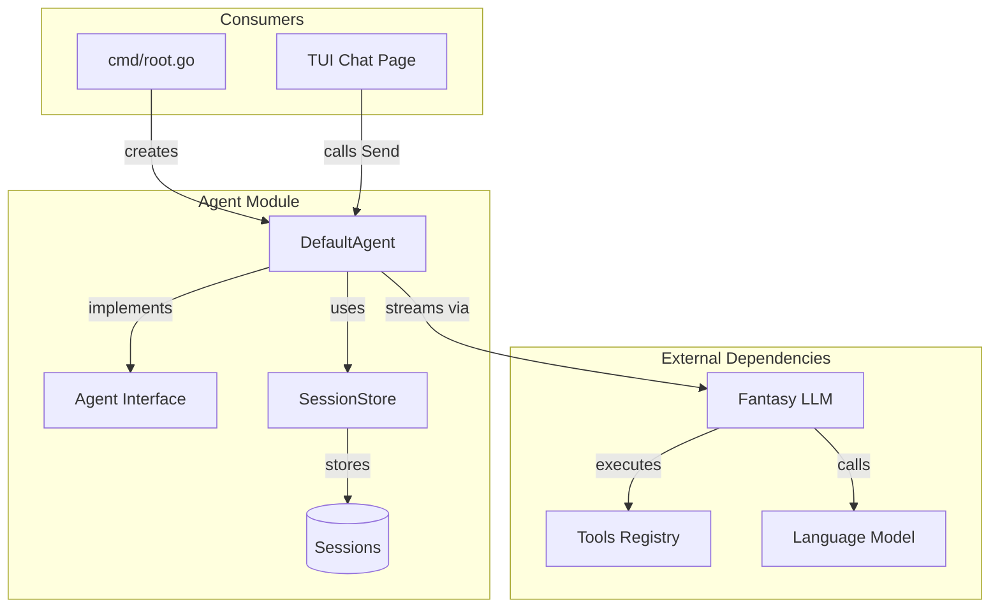
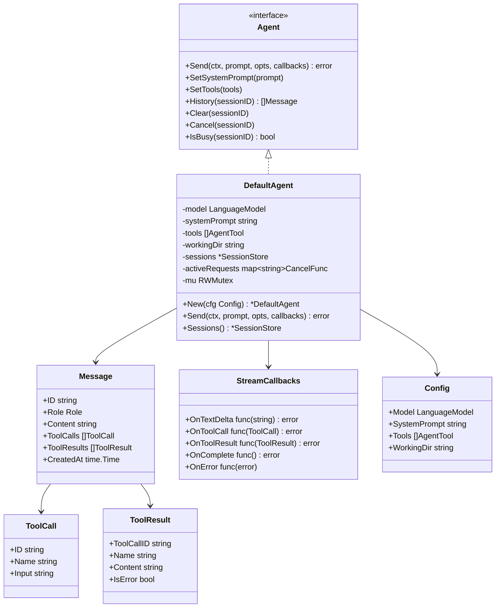
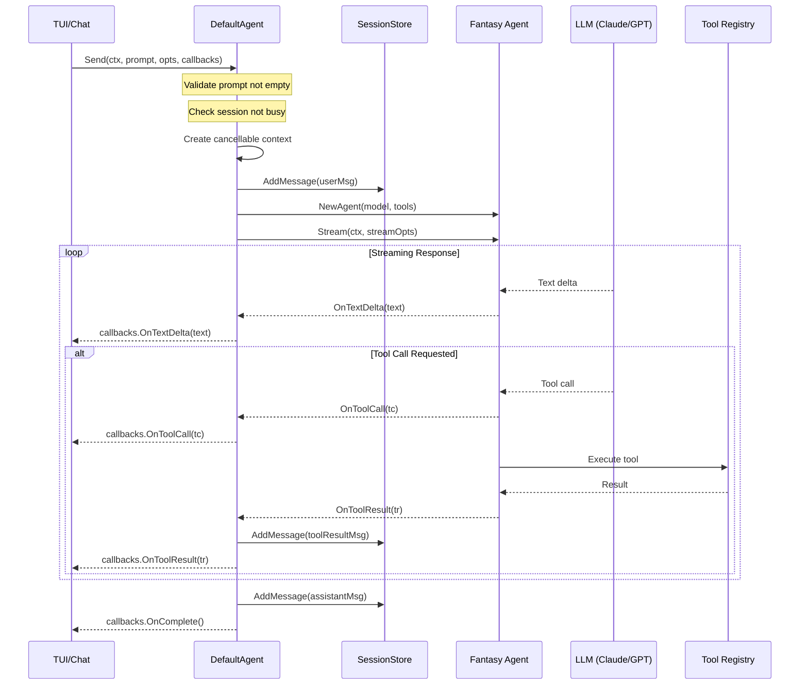
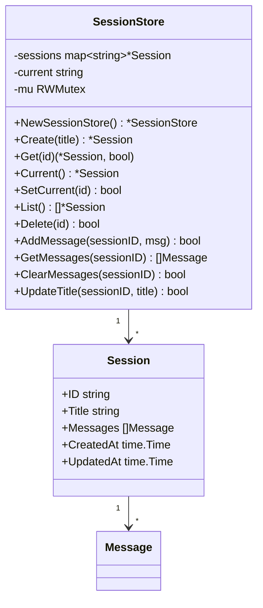
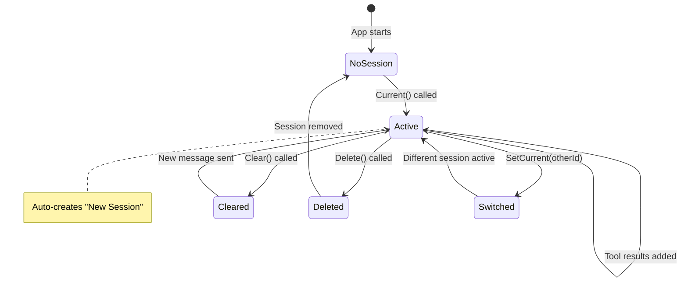
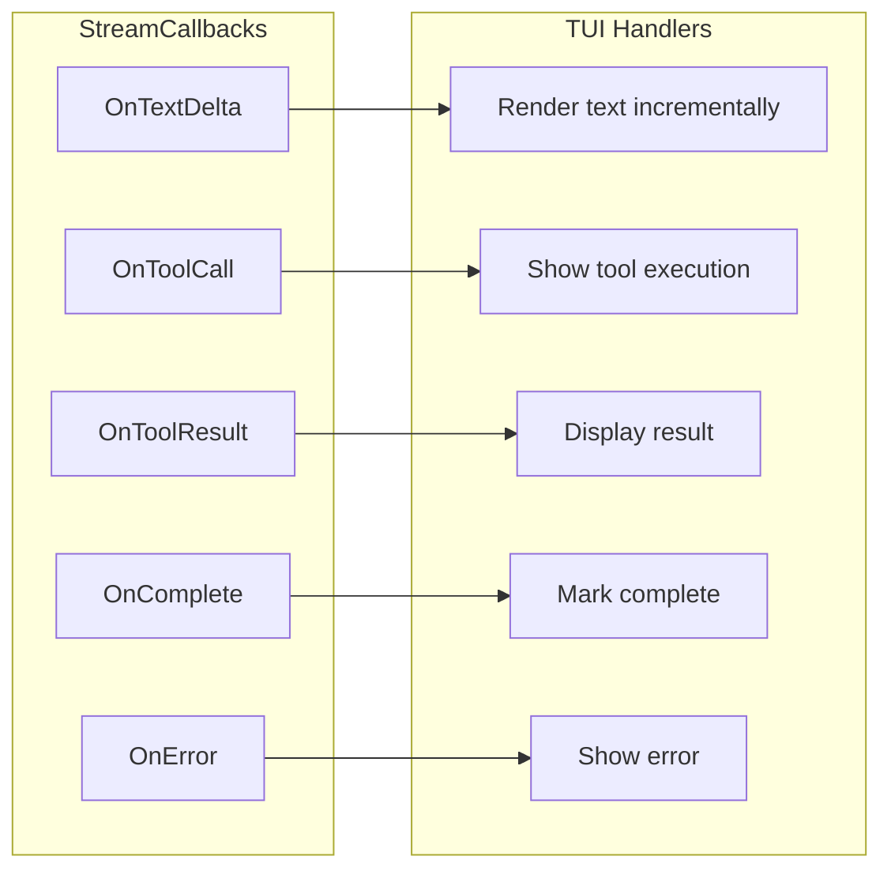
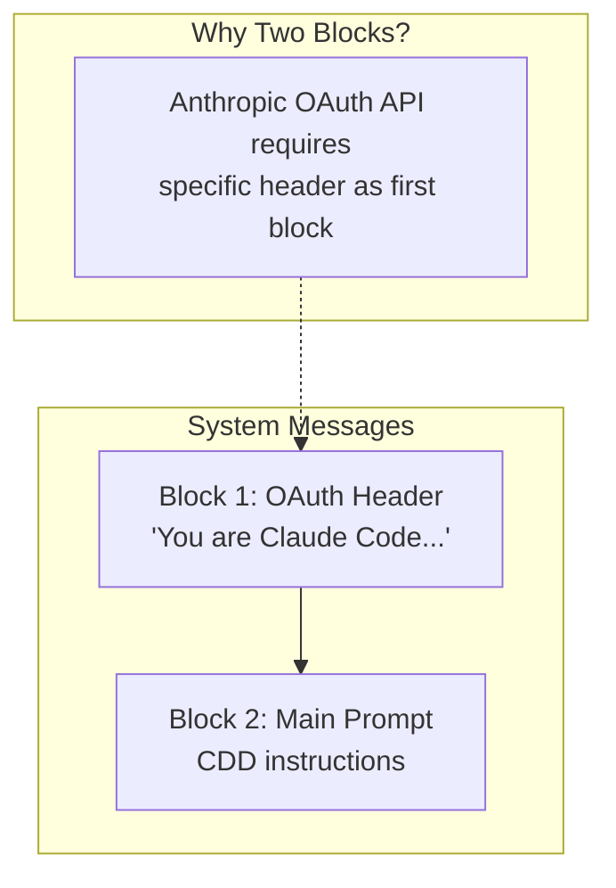
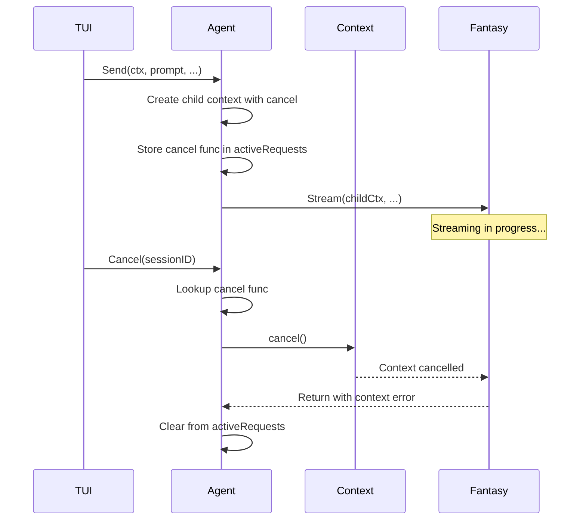
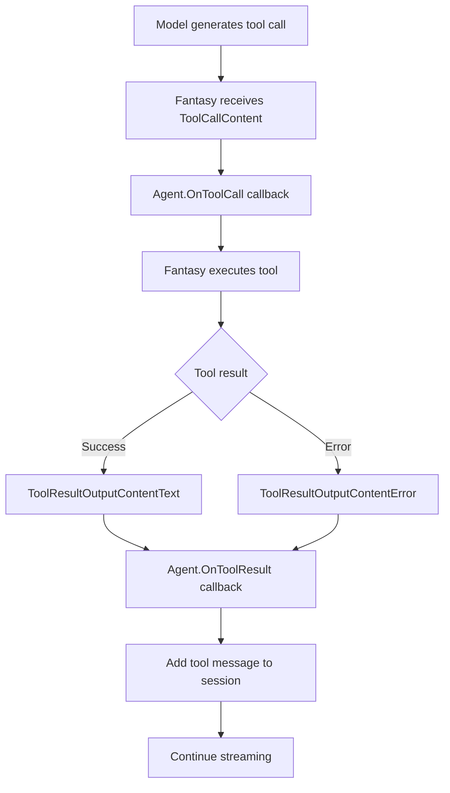
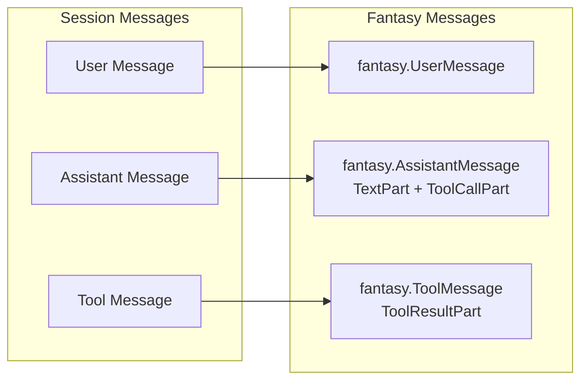

# Agent Module

The agent module provides the core AI agent implementation for CDD CLI. It handles communication with language models, manages conversation sessions, executes tools, and streams responses.

## Overview

| Aspect | Details |
|--------|---------|
| Location | `internal/agent/` |
| Files | 4 source files + 2 test files (~1370 lines total) |
| Purpose | AI agent orchestration and conversation management |
| Dependencies | Fantasy (LLM), Tools registry |

## Package Structure

```
internal/agent/
├── agent.go       - Core types: Message, ToolCall, ToolResult, Agent interface
├── loop.go        - DefaultAgent implementation, Send() logic, streaming
├── session.go     - Session and SessionStore for conversation state
├── prompt.go      - Default system prompt definition
├── loop_test.go   - Tests for agent execution
└── session_test.go - Tests for session management
```

## Architecture



## Data Types



### Role Enum

| Role | Value | Description |
|------|-------|-------------|
| `RoleUser` | `"user"` | User input messages |
| `RoleAssistant` | `"assistant"` | AI responses (text + tool calls) |
| `RoleSystem` | `"system"` | System prompt (handled separately) |
| `RoleTool` | `"tool"` | Tool execution results |

## Agent Execution Flow

The `Send()` method orchestrates the complete request-response cycle:



## Session Management

Sessions maintain conversation state across multiple exchanges.



### Session Lifecycle



### Thread Safety

All SessionStore operations are protected by `sync.RWMutex`:

| Operation | Lock Type | Notes |
|-----------|-----------|-------|
| `Create()` | Write | Creates session and sets as current |
| `Get()` | Read | Returns session reference |
| `Current()` | Read → Write | Read first, create if needed |
| `AddMessage()` | Write | Appends to session |
| `GetMessages()` | Read | Returns copy of messages |
| `ClearMessages()` | Write | Empties message slice |
| `Delete()` | Write | Removes from map |

## Streaming and Callbacks

The agent uses callbacks for real-time streaming:



**Callback Flow:**

1. **OnTextDelta**: Called for each text chunk from the model
2. **OnToolCall**: Called when the model requests a tool execution
3. **OnToolResult**: Called after a tool completes (success or error)
4. **OnComplete**: Called when the full response is complete
5. **OnError**: Called if an error occurs during streaming

## System Prompt

The agent uses a two-part system prompt for OAuth compatibility:



**Default System Prompt** (`prompt.go`):

```
You are CDD (Context-Driven Development), an AI coding assistant.

You help developers write, understand, and improve code through structured workflows.

When working with code:
1. Read files before modifying them
2. Use appropriate tools for the task
3. Explain your reasoning clearly
4. Ask clarifying questions when requirements are unclear

Available tools allow you to read files, search code, write files, edit code,
and execute shell commands.
```

## Request Cancellation

The agent supports cancelling in-flight requests:



**Key Methods:**

| Method | Purpose |
|--------|---------|
| `Cancel(sessionID)` | Cancels ongoing request for session |
| `IsBusy(sessionID)` | Returns true if request in progress |
| `setActiveRequest()` | Internal: stores cancel func |
| `clearActiveRequest()` | Internal: removes cancel func |

## Tool Execution

Tools are executed by Fantasy during the agent loop:



**Tool Result Types:**

| Type | Description |
|------|-------------|
| `Text` | Successful result with text content |
| `Error` | Failed execution with error message |
| `Media` | Binary content (treated as unsupported) |

## History Building

The agent converts session messages to Fantasy format for context:



**Important:** The last message (current user input) is excluded from history since it's passed separately as the prompt.

## API Reference

### Agent Interface

| Method | Signature | Description |
|--------|-----------|-------------|
| `Send` | `(ctx, prompt, opts, callbacks) error` | Send message and stream response |
| `SetSystemPrompt` | `(prompt string)` | Update system prompt |
| `SetTools` | `(tools []AgentTool)` | Update available tools |
| `History` | `(sessionID) []Message` | Get conversation history |
| `Clear` | `(sessionID)` | Clear session history |
| `Cancel` | `(sessionID)` | Cancel ongoing request |
| `IsBusy` | `(sessionID) bool` | Check if request in progress |

### DefaultAgent Additional Methods

| Method | Signature | Description |
|--------|-----------|-------------|
| `New` | `(cfg Config) *DefaultAgent` | Create new agent |
| `Sessions` | `() *SessionStore` | Get session store |

### SessionStore Methods

| Method | Signature | Description |
|--------|-----------|-------------|
| `NewSessionStore` | `() *SessionStore` | Create empty store |
| `Create` | `(title) *Session` | Create and set as current |
| `Get` | `(id) (*Session, bool)` | Get session by ID |
| `Current` | `() *Session` | Get or create current session |
| `SetCurrent` | `(id) bool` | Switch current session |
| `List` | `() []*Session` | Get all sessions |
| `Delete` | `(id) bool` | Remove session |
| `AddMessage` | `(sessionID, msg) bool` | Add message to session |
| `GetMessages` | `(sessionID) []Message` | Get session messages (copy) |
| `ClearMessages` | `(sessionID) bool` | Clear session messages |
| `UpdateTitle` | `(sessionID, title) bool` | Update session title |

### Error Types

| Error | Description |
|-------|-------------|
| `ErrSessionBusy` | Session already processing a request |
| `ErrEmptyPrompt` | Empty prompt provided |

## Design Decisions

1. **Interface-based design**: `Agent` interface allows for alternative implementations (testing, mocking)

2. **Session isolation**: Each session maintains its own message history, enabling multiple conversations

3. **In-memory storage**: Sessions are stored in memory for simplicity; persistence can be added later

4. **Callback-based streaming**: Allows TUI to render responses incrementally without buffering

5. **Two-block system prompt**: Required for Anthropic OAuth API compatibility

6. **Copy on read**: `GetMessages()` returns a copy to prevent external mutation

7. **Context cancellation**: Proper cleanup of in-flight requests using context

8. **Tool context injection**: Working directory and session ID passed via context values

## Integration Points

### With TUI (Chat Page)

```go
// Create agent in cmd/root.go
agent := agent.New(agent.Config{
    Model:        largeModel,
    Tools:        registry.All(),
    SystemPrompt: agent.DefaultSystemPrompt,
})

// Use in chat page
agent.Send(ctx, userInput, agent.SendOptions{}, agent.StreamCallbacks{
    OnTextDelta: func(text string) error {
        // Update UI with streaming text
        return nil
    },
    OnToolCall: func(tc agent.ToolCall) error {
        // Show tool being executed
        return nil
    },
})
```

### With Tools Registry

```go
// Tools are passed at agent creation
registry := tools.DefaultRegistry(workingDir)
agent := agent.New(agent.Config{
    Tools: registry.All(),
})
```

### With Provider/Fantasy

```go
// Model comes from provider builder
builder := provider.NewBuilder(cfg)
largeModel, _, _ := builder.BuildModels(ctx)

agent := agent.New(agent.Config{
    Model: largeModel.Model, // fantasy.LanguageModel
})
```

---

## Related Documentation

- [Provider System](./provider-system.md) - How models are built and configured
- [TUI Wizard](./tui-wizard.md) - Chat page that uses the agent
- [Config Module](./config-module.md) - Configuration that drives agent setup
