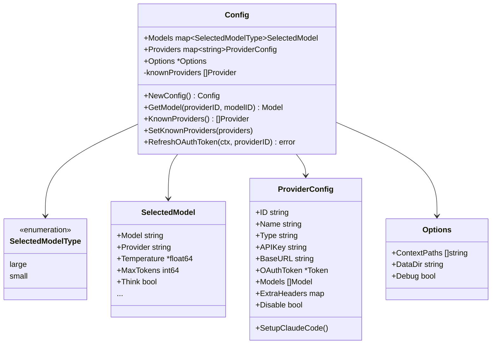
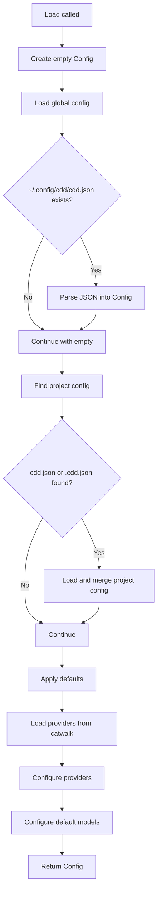
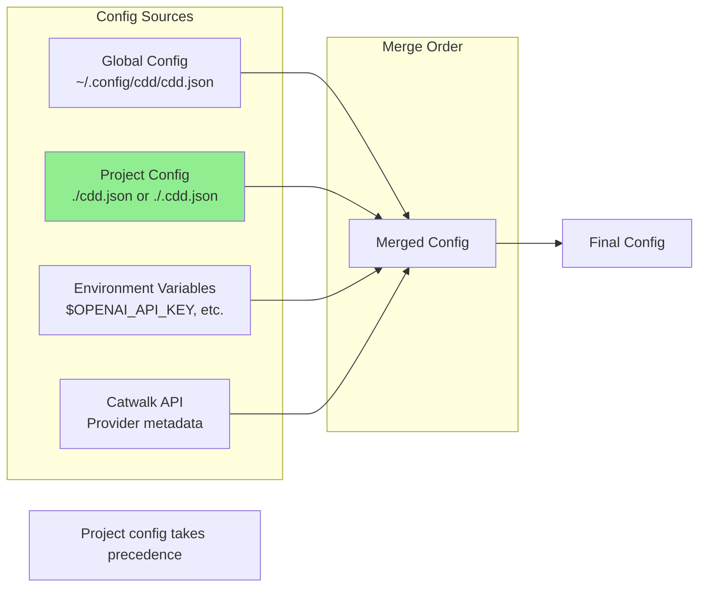
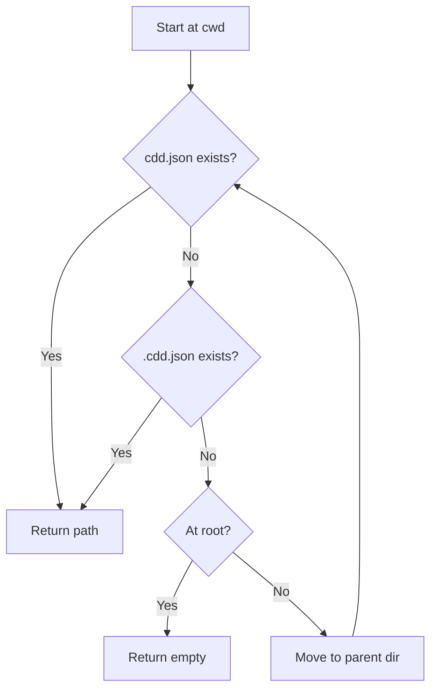
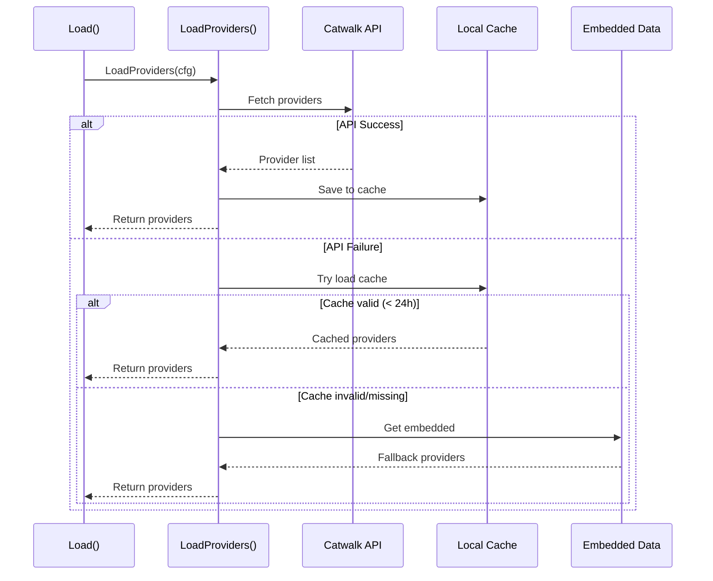
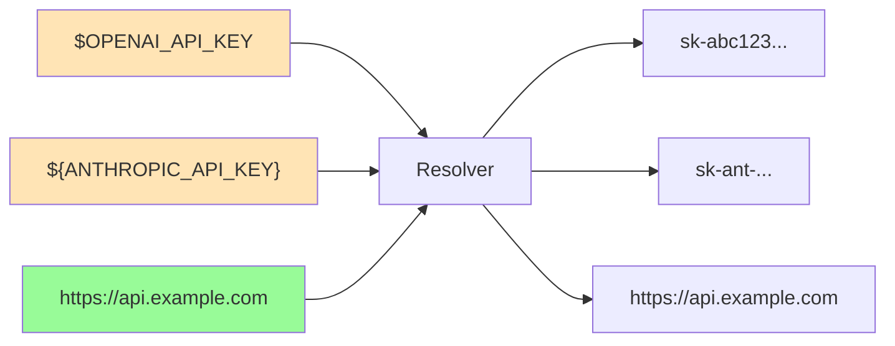
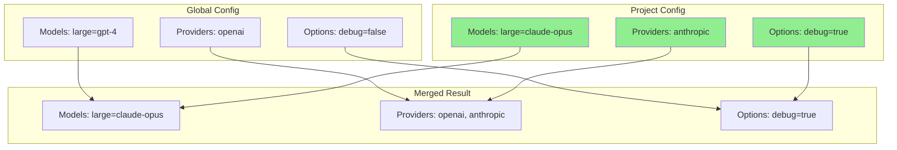
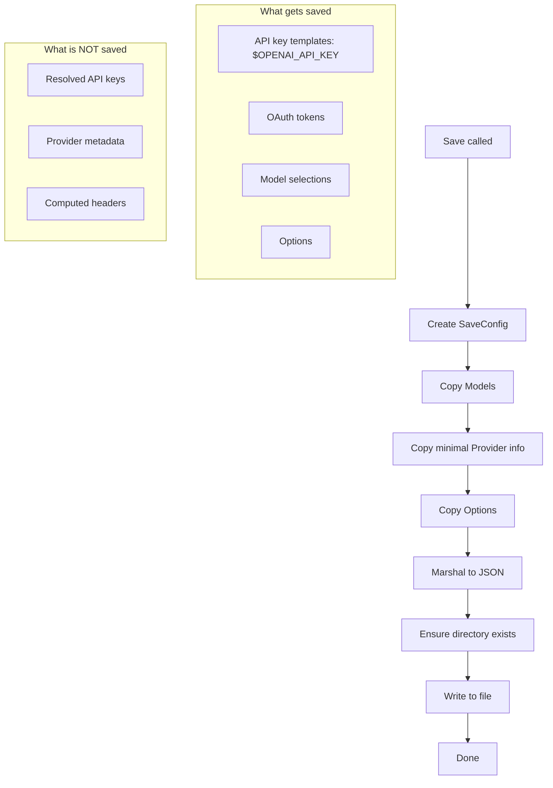
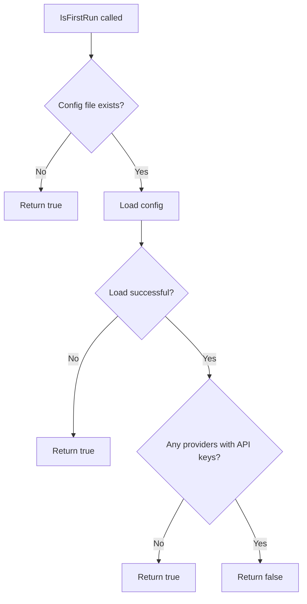

# Config Module

The config module provides configuration management for CDD CLI. It handles loading, merging, and saving configuration from multiple sources with environment variable resolution.

## Overview

| Aspect | Details |
|--------|---------|
| Location | `internal/config/` |
| Files | 6 source files (~900 lines total) |
| Purpose | Configuration management |
| Config Format | JSON |

## Package Structure

```
internal/config/
├── config.go      - Core types: Config, ProviderConfig, SelectedModel
├── load.go        - Load and merge config from files
├── save.go        - Save config to disk
├── firstrun.go    - Detect first run / needs setup
├── providers.go   - Fetch/cache provider metadata
└── resolve.go     - Resolve $ENV_VAR in config values
```

## Data Types



## Load Flow

The `Load()` function is the main entry point, called from `cmd/root.go`.



## Config Sources



## Project Config Search

The `findProjectConfig()` function searches upward from the current directory:



## Provider Loading



## Environment Variable Resolution

The `Resolver` expands environment variables in config values:



**Supported syntax:**
- `$VAR` - Simple variable
- `${VAR}` - Braced variable

## Config Merge Strategy

When both global and project configs exist:



**Rule:** Project config values override global config values.

## Save Flow



## First Run Detection



## File Locations

| File | Path | Purpose |
|------|------|---------|
| Global config | `~/.config/cdd/cdd.json` | User-wide settings |
| Project config | `./cdd.json` or `./.cdd.json` | Project-specific overrides |
| Provider cache | `~/.local/share/cdd/providers.json` | Cached catwalk data |
| Data directory | `~/.local/share/cdd/` | App data storage |

## Usage Examples

### Basic Config File

```json
{
  "providers": {
    "anthropic": {
      "api_key": "$ANTHROPIC_API_KEY"
    }
  },
  "models": {
    "large": {
      "provider": "anthropic",
      "model": "claude-sonnet-4-20250514"
    },
    "small": {
      "provider": "anthropic",
      "model": "claude-haiku-3-5-20241022"
    }
  }
}
```

### Multi-Provider Config

```json
{
  "providers": {
    "anthropic": {
      "api_key": "$ANTHROPIC_API_KEY"
    },
    "openai": {
      "api_key": "$OPENAI_API_KEY"
    }
  },
  "models": {
    "large": {
      "provider": "anthropic",
      "model": "claude-opus-4-5-20251101"
    },
    "small": {
      "provider": "openai",
      "model": "gpt-4o-mini"
    }
  }
}
```

## API Reference

### Load Functions

| Function | Purpose |
|----------|---------|
| `Load()` | Load config from standard locations |
| `LoadFromFile(path)` | Load config from specific file |
| `LoadProviders(cfg)` | Fetch provider metadata |

### Save Functions

| Function | Purpose |
|----------|---------|
| `Save(cfg)` | Save to global config path |
| `SaveToFile(cfg, path)` | Save to specific path |
| `SaveWizardResult(...)` | Save setup wizard result (API key) |
| `SaveWizardResultWithOAuth(...)` | Save setup wizard result (OAuth) |

### Check Functions

| Function | Purpose |
|----------|---------|
| `IsFirstRun()` | Check if this is first run |
| `NeedsSetup()` | Check if setup is incomplete |

### Utility Functions

| Function | Purpose |
|----------|---------|
| `GlobalConfigPath()` | Get global config file path |
| `DefaultDataDir()` | Get default data directory |
| `NewResolver()` | Create environment resolver |

## Design Decisions

1. **Two-tier model selection**: "large" for complex tasks, "small" for fast/cheap tasks
2. **Environment variable support**: API keys stored as `$VAR` templates, resolved at load time
3. **Project config override**: Allows per-project customization
4. **Fallback chain for providers**: API → Cache → Embedded ensures offline functionality
5. **Minimal save format**: Only saves what's needed, not runtime-computed values
6. **XDG compliance**: Uses standard Linux directory locations
