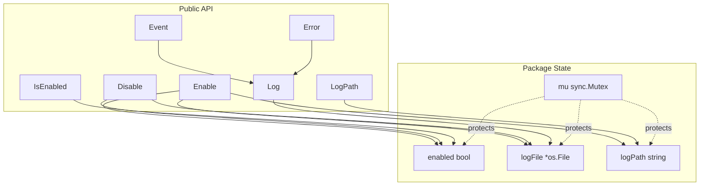
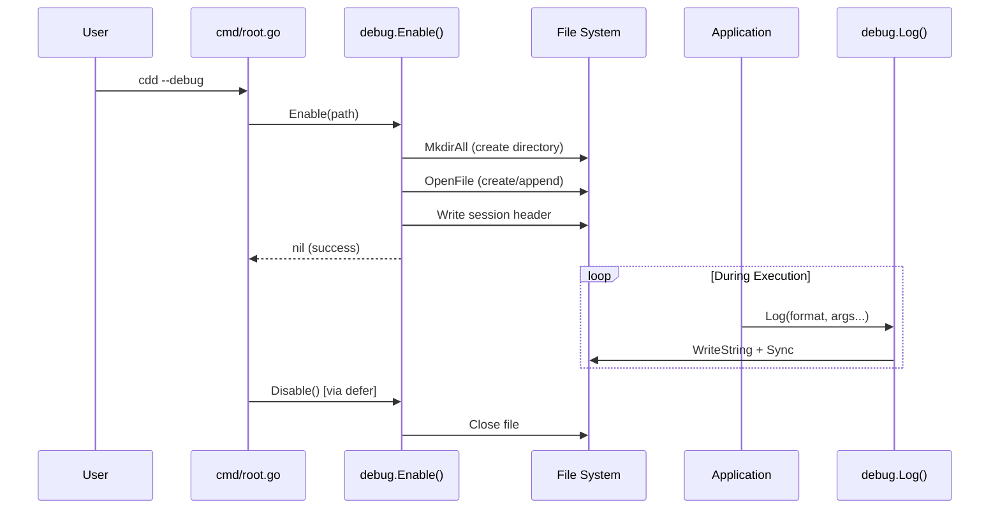
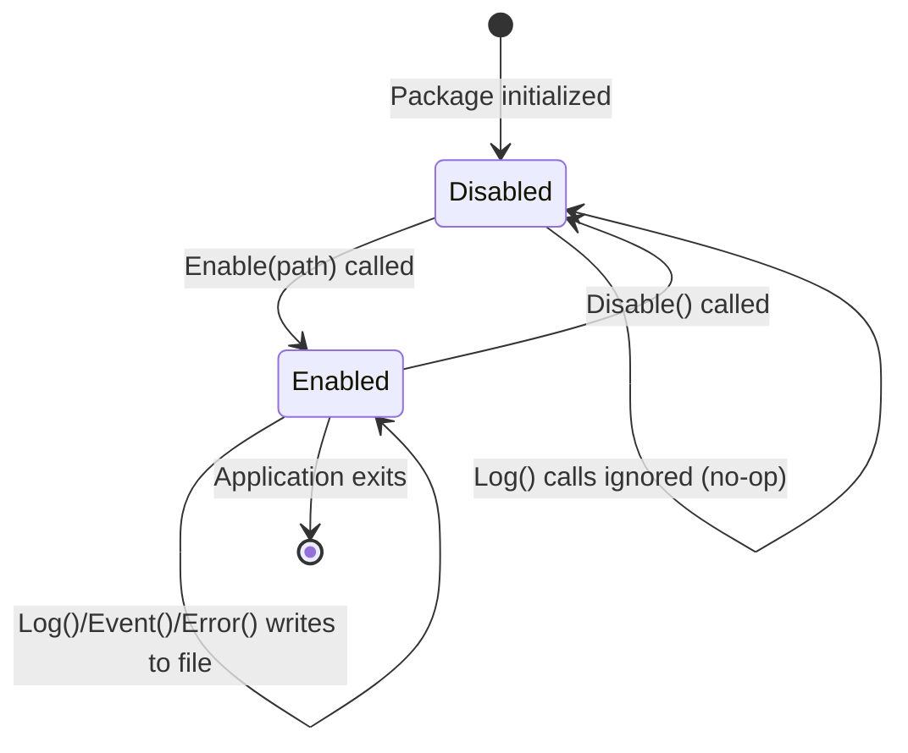
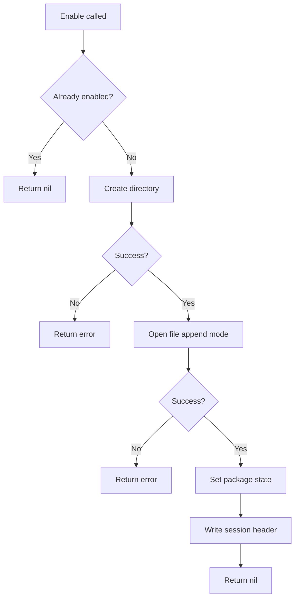
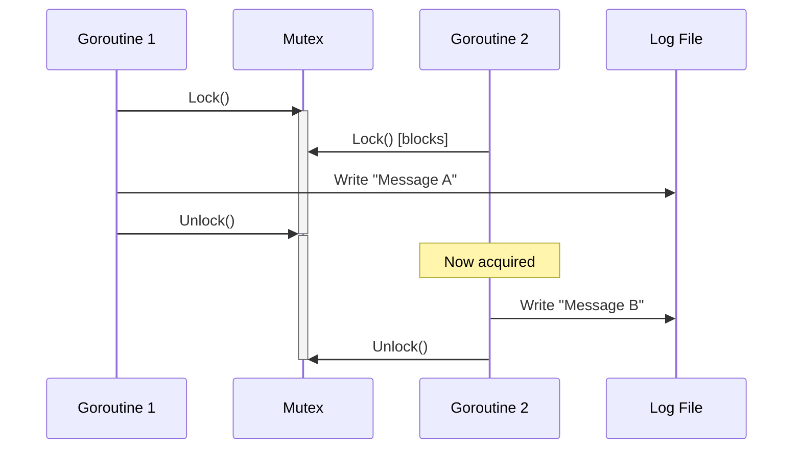

# Debug Module

The debug module provides development logging for CDD CLI. It offers a simple, thread-safe file-based logger that can be enabled at runtime.

## Overview

| Aspect | Details |
|--------|---------|
| Location | `internal/debug/debug.go` |
| Size | ~112 lines |
| Purpose | Development-time logging to file |
| Thread Safety | Yes (via `sync.Mutex`) |

## Architecture



## Data Flow



## Lifecycle



## Entry Point

The debug module is activated from `cmd/root.go`:

```go
func runTUI(cmd *cobra.Command, _ []string) error {
    debugMode, err := cmd.Flags().GetBool("debug")
    if err != nil {
        return fmt.Errorf("getting debug flag: %w", err)
    }
    if debugMode {
        logPath := filepath.Join(xdg.DataHome, "cdd", "debug.log")
        if debugErr := debug.Enable(logPath); debugErr != nil {
            fmt.Fprintf(os.Stderr, "Warning: Failed to enable debug logging: %v\n", debugErr)
        } else {
            defer debug.Disable()
            fmt.Fprintf(os.Stderr, "Debug: %s\n", logPath)
        }
    }
    // ... rest of function
}
```

## API Reference

### Enable(path string) error

Opens the log file and enables logging.



### Disable()

Closes the log file and disables logging.

```go
func Disable() {
    mu.Lock()
    defer mu.Unlock()

    if !enabled {
        return
    }

    if logFile != nil {
        _ = logFile.Close()
        logFile = nil
    }
    enabled = false
}
```

### Log(format string, args ...any)

Writes a timestamped message to the log file.

```go
// Example usage
debug.Log("User clicked button: %s", buttonName)
debug.Log("Request completed in %dms", elapsed)
```

**Output format:**
```
[15:04:05.123] User clicked button: submit
[15:04:05.456] Request completed in 42ms
```

### Event(component, eventType, details string)

Convenience wrapper for logging TUI events.

```go
// Example usage
debug.Event("chat", "keypress", "ctrl+c")
debug.Event("wizard", "step", "provider selection")
```

**Output format:**
```
[15:04:05.123] [chat] keypress: ctrl+c
[15:04:05.456] [wizard] step: provider selection
```

### Error(component string, err error, context string)

Convenience wrapper for logging errors.

```go
// Example usage
debug.Error("agent", err, "failed to send message")
```

**Output format:**
```
[15:04:05.123] [agent] ERROR: failed to send message - connection timeout
```

### IsEnabled() bool

Returns whether debug logging is currently enabled.

### LogPath() string

Returns the path to the current log file.

## Thread Safety

All functions are protected by a mutex to ensure thread-safe access from multiple goroutines:



## File Location

Default log path: `~/.local/share/cdd/debug.log`

This follows the XDG Base Directory Specification using `xdg.DataHome`.

## Usage

Enable debug logging when running CDD:

```bash
cdd --debug
```

View logs in real-time:

```bash
tail -f ~/.local/share/cdd/debug.log
```

## Design Decisions

1. **Package-level state**: Appropriate for a singleton logger pattern
2. **Sync after each write**: Ensures logs are visible immediately for `tail -f`
3. **Append mode**: Preserves logs across sessions
4. **Ignored errors on write**: Debug logging should never crash the app
5. **Mutex protection**: Safe for concurrent goroutine access
