# Tools Module

The tools module provides agent tools for CDD CLI. It implements the registry pattern for managing tools and provides individual tools for file operations, code search, and shell execution.

## Overview

| Aspect | Details |
|--------|---------|
| Location | `internal/tools/` |
| Files | 8 source files + 6 test files (~3000 lines total) |
| Purpose | Agent tool definitions and registry |
| Dependencies | Fantasy (tool interface) |

## Package Structure

```
internal/tools/
├── registry.go      - Tool registry and metadata management
├── tool.go          - Context utilities and file tracking
├── read.go          - File reading tool
├── read_test.go     - Read tool tests
├── write.go         - File writing tool
├── write_test.go    - Write tool tests
├── edit.go          - File editing tool (search/replace)
├── edit_test.go     - Edit tool tests
├── glob.go          - File pattern matching tool
├── glob_test.go     - Glob tool tests
├── grep.go          - Content search tool
├── grep_test.go     - Grep tool tests
├── bash.go          - Shell command execution tool
└── bash_test.go     - Bash tool tests
```

## Architecture

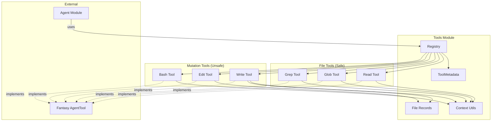

## Tool Registry

The registry manages tool registration, lookup, and filtering.

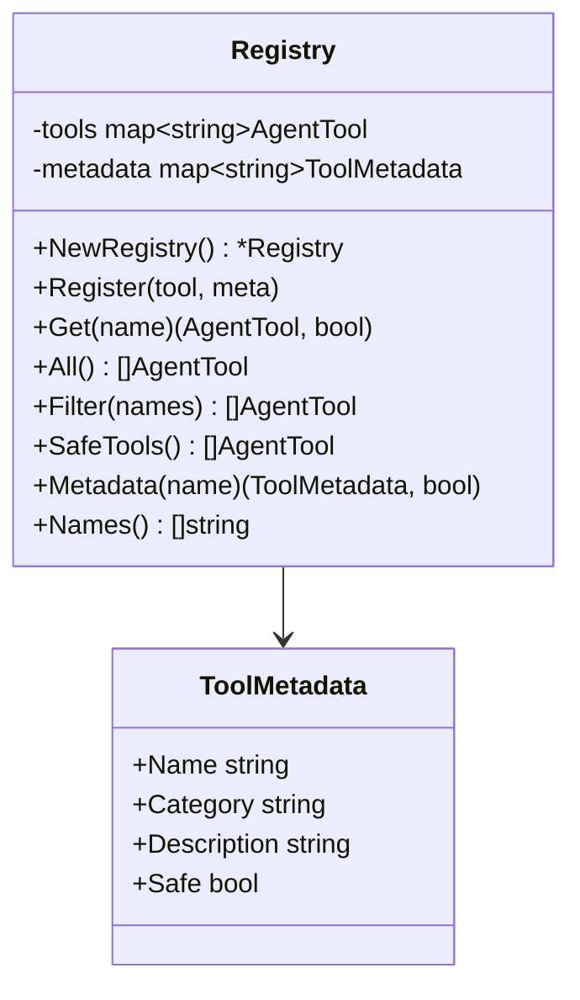

### Default Registry

The `DefaultRegistry()` function creates a registry with all standard tools:

| Tool | Name | Category | Safe | Description |
|------|------|----------|------|-------------|
| Read | `read` | file | ✅ | Read file contents with line numbers |
| Glob | `glob` | file | ✅ | Find files by pattern |
| Grep | `grep` | file | ✅ | Search file contents |
| Write | `write` | file | ❌ | Write or create files |
| Edit | `edit` | file | ❌ | Edit file contents |
| Bash | `bash` | system | ❌ | Execute shell commands |

**Safe vs Unsafe:**
- **Safe tools** only read data, never modify files or execute commands
- **Unsafe tools** can modify files or execute arbitrary commands

## Context Utilities

Tools receive context values for session tracking and path resolution.

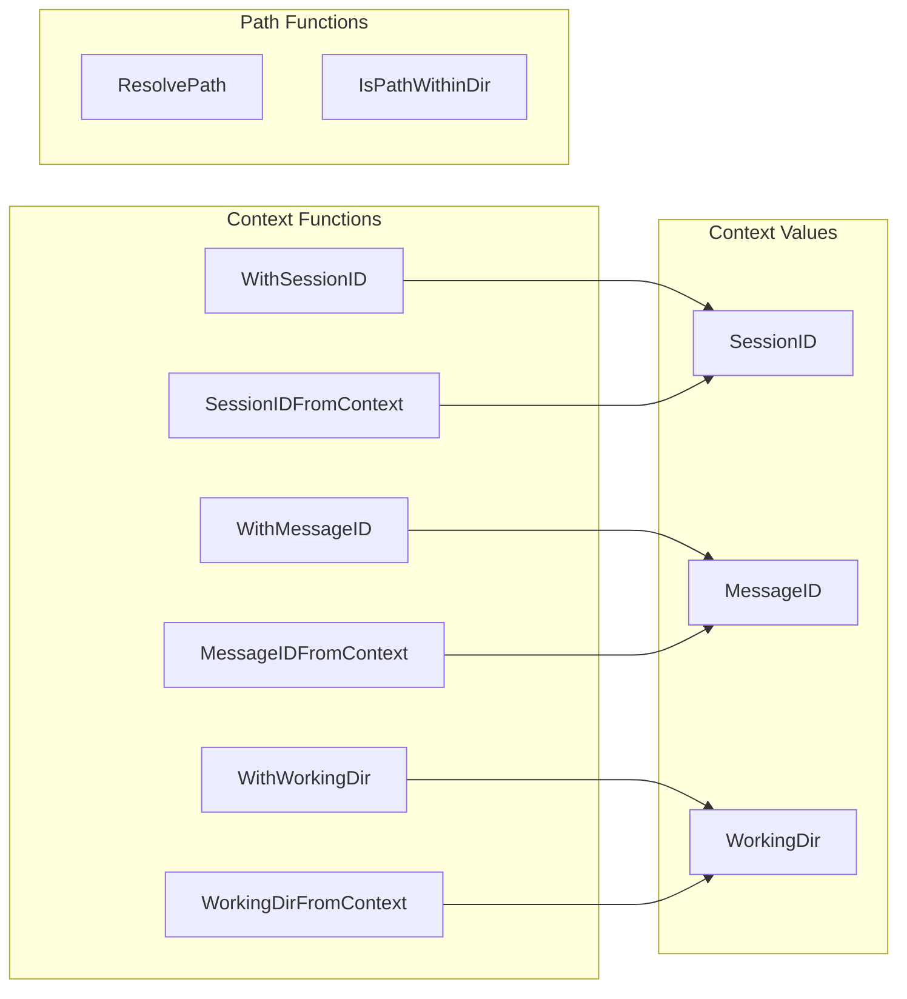

### Path Resolution

```go
// ResolvePath resolves relative paths against working directory
ResolvePath("/home/user/project", "src/main.go")
// Returns: /home/user/project/src/main.go

ResolvePath("/home/user/project", "/etc/passwd")
// Returns: /etc/passwd (absolute paths unchanged)
```

## File Tracking

The module tracks file read/write times to detect conflicts.

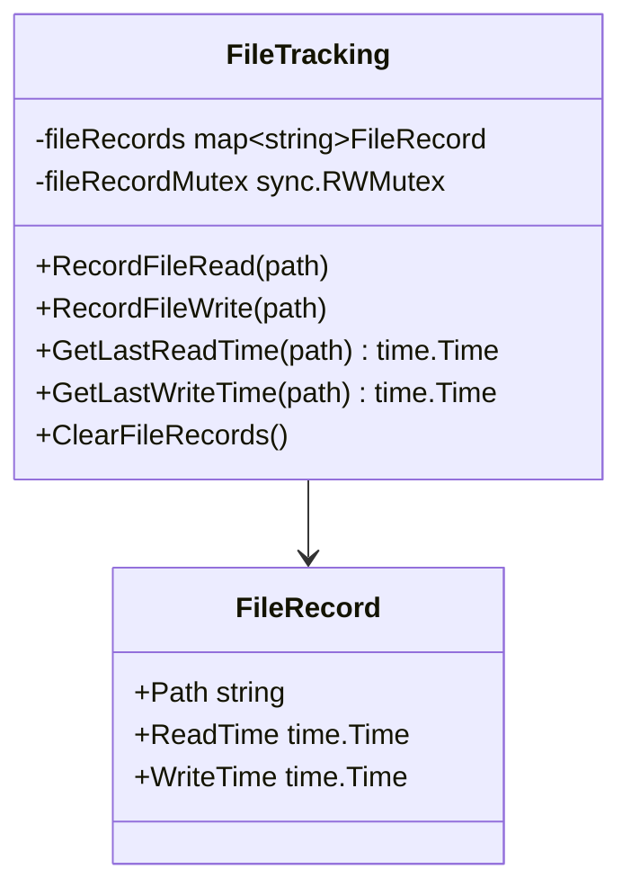

**Purpose:** Prevents overwriting files modified externally since last read.

---

## Individual Tools

### Read Tool

Reads file contents with line numbers.

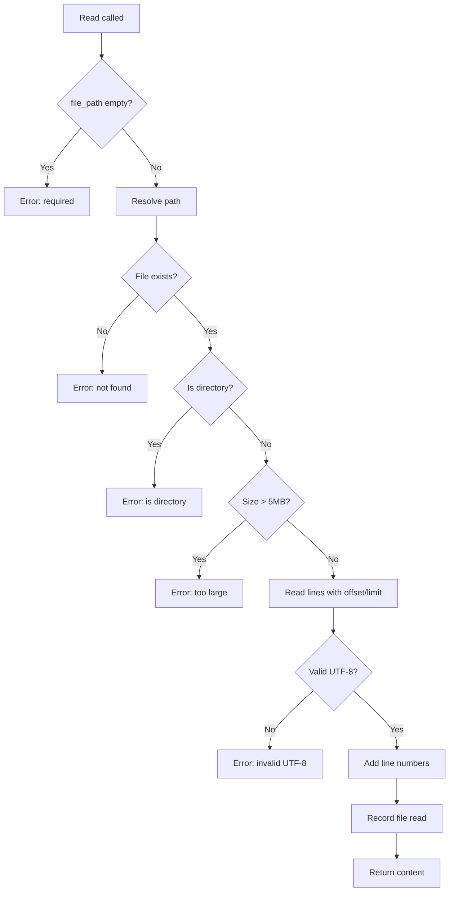

**Parameters:**

| Parameter | Type | Required | Default | Description |
|-----------|------|----------|---------|-------------|
| `file_path` | string | Yes | - | Absolute path to file |
| `offset` | int | No | 0 | Line number to start from (0-based) |
| `limit` | int | No | 2000 | Number of lines to read |

**Constants:**

| Constant | Value | Description |
|----------|-------|-------------|
| `MaxReadSize` | 5MB | Maximum file size |
| `DefaultReadLimit` | 2000 | Default lines to read |
| `MaxLineLength` | 2000 | Lines truncated beyond this |

**Output Format:**
```
     1→package main
     2→
     3→import "fmt"
     4→
     5→func main() {
     6→    fmt.Println("Hello")
     7→}
```

---

### Write Tool

Writes content to a file, creating parent directories if needed.

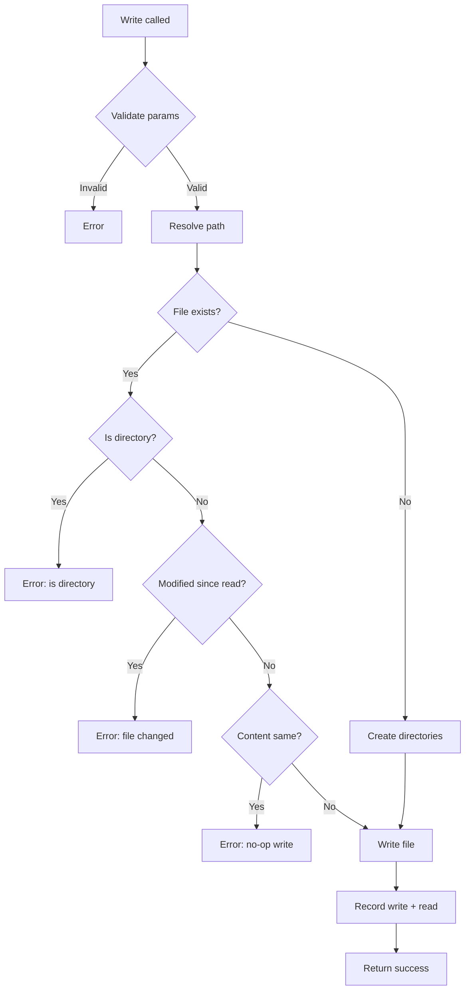

**Parameters:**

| Parameter | Type | Required | Description |
|-----------|------|----------|-------------|
| `file_path` | string | Yes | Absolute path to file |
| `content` | string | Yes | Content to write |

**Safety Checks:**
1. Detects if file modified since last read (conflict prevention)
2. Detects no-op writes (content already matches)
3. Creates parent directories automatically

---

### Edit Tool

Performs search-and-replace operations on files.

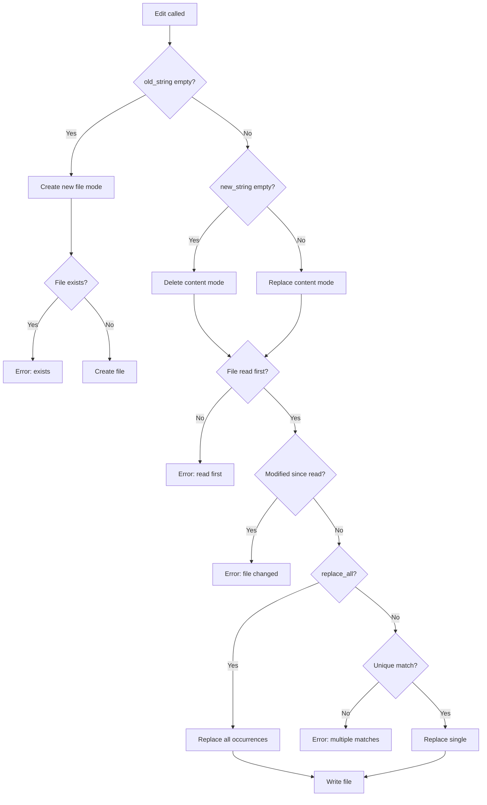

**Parameters:**

| Parameter | Type | Required | Description |
|-----------|------|----------|-------------|
| `file_path` | string | Yes | Absolute path to file |
| `old_string` | string | No | Text to find (empty = create new file) |
| `new_string` | string | No | Replacement text (empty = delete) |
| `replace_all` | bool | No | Replace all occurrences (default: false) |

**Modes:**

| old_string | new_string | Mode |
|------------|------------|------|
| Empty | Content | Create new file |
| Content | Empty | Delete matches |
| Content | Content | Replace matches |

**Uniqueness Requirement:** Without `replace_all`, the `old_string` must appear exactly once in the file.

---

### Glob Tool

Finds files matching a glob pattern.

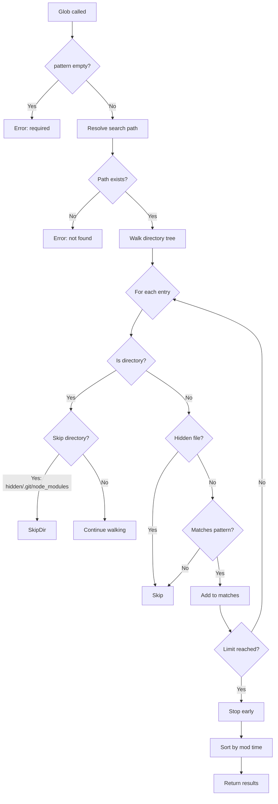

**Parameters:**

| Parameter | Type | Required | Description |
|-----------|------|----------|-------------|
| `pattern` | string | Yes | Glob pattern (e.g., `**/*.go`) |
| `path` | string | No | Search directory (default: working dir) |

**Pattern Support:**
- `*` - Match any characters in filename
- `**` - Match any path segments
- `**/*.go` - All `.go` files recursively
- `src/**/*.ts` - All `.ts` files under `src/`

**Skipped Directories:**
- Hidden directories (`.git`, `.vscode`, etc.)
- `node_modules`, `vendor`, `__pycache__`

**Limits:**
- Results capped at 100 files
- Sorted by modification time (newest first)

---

### Grep Tool

Searches file contents using regex patterns.

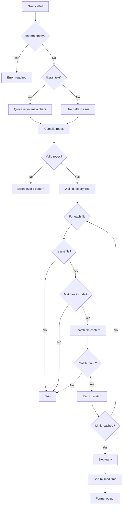

**Parameters:**

| Parameter | Type | Required | Description |
|-----------|------|----------|-------------|
| `pattern` | string | Yes | Regex pattern to search |
| `path` | string | No | Search directory |
| `include` | string | No | File pattern filter (e.g., `*.go`) |
| `literal_text` | bool | No | Treat pattern as literal text |

**Features:**
- Full regex support (`log.*Error`, `function\s+\w+`)
- Cached regex compilation for performance
- MIME-type detection for text files
- Brace expansion in include patterns (`*.{ts,tsx}`)

**Output Format:**
```
Found 3 matches
src/main.go:
  Line 15, Char 5: func handleError(err error) {
  Line 42, Char 12: return fmt.Errorf("error: %w", err)
pkg/utils.go:
  Line 8: type Error struct {
```

---

### Bash Tool

Executes shell commands with safety restrictions.

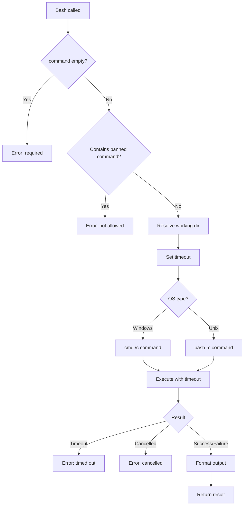

**Parameters:**

| Parameter | Type | Required | Default | Description |
|-----------|------|----------|---------|-------------|
| `command` | string | Yes | - | Command to execute |
| `description` | string | No | - | Brief description |
| `working_dir` | string | No | Agent's dir | Execution directory |
| `timeout` | int | No | 120000 | Timeout in milliseconds |

**Banned Commands:**

| Category | Commands |
|----------|----------|
| Network | `curl`, `wget`, `ssh`, `scp`, `nc`, `telnet` |
| Browsers | `chrome`, `firefox`, `safari` |
| Privilege | `sudo`, `su`, `doas` |
| Package Mgmt | `apt`, `apt-get`, `yum`, `dnf`, `pacman`, `brew` |
| System | `systemctl`, `service`, `mount`, `umount`, `fdisk`, `mkfs` |
| Network Config | `iptables`, `ufw`, `firewall-cmd`, `ifconfig`, `ip` |

**Timeout Limits:**
- Default: 2 minutes (120,000ms)
- Maximum: 10 minutes (600,000ms)

**Output Handling:**
- Combined stdout/stderr output
- Truncated at 30,000 characters (middle section removed)
- Exit code included for non-zero exits

---

## Tool Execution Flow

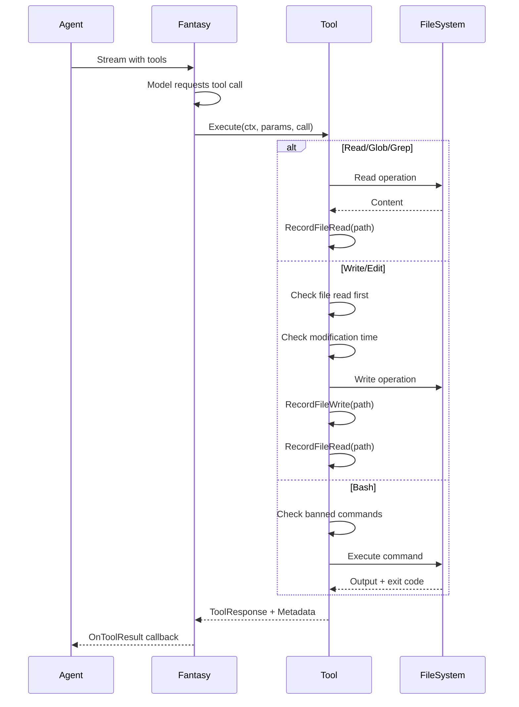

## API Reference

### Registry Methods

| Method | Signature | Description |
|--------|-----------|-------------|
| `NewRegistry` | `() *Registry` | Create empty registry |
| `DefaultRegistry` | `(workingDir) *Registry` | Create with default tools |
| `Register` | `(tool, meta)` | Add tool with metadata |
| `Get` | `(name) (AgentTool, bool)` | Get tool by name |
| `All` | `() []AgentTool` | Get all tools |
| `Filter` | `(names) []AgentTool` | Get tools by names |
| `SafeTools` | `() []AgentTool` | Get only safe tools |
| `Metadata` | `(name) (ToolMetadata, bool)` | Get tool metadata |
| `Names` | `() []string` | Get all tool names |

### Context Functions

| Function | Description |
|----------|-------------|
| `WithSessionID(ctx, id)` | Add session ID to context |
| `SessionIDFromContext(ctx)` | Get session ID from context |
| `WithMessageID(ctx, id)` | Add message ID to context |
| `MessageIDFromContext(ctx)` | Get message ID from context |
| `WithWorkingDir(ctx, dir)` | Add working directory to context |
| `WorkingDirFromContext(ctx)` | Get working directory from context |

### Path Functions

| Function | Description |
|----------|-------------|
| `ResolvePath(workingDir, path)` | Resolve relative path |
| `IsPathWithinDir(path, dir)` | Check if path is within directory |

### File Tracking Functions

| Function | Description |
|----------|-------------|
| `RecordFileRead(path)` | Record file was read |
| `RecordFileWrite(path)` | Record file was written |
| `GetLastReadTime(path)` | Get last read timestamp |
| `GetLastWriteTime(path)` | Get last write timestamp |
| `ClearFileRecords()` | Clear all records |

## Design Decisions

1. **Registry pattern**: Centralizes tool management and allows filtering by safety/category

2. **Safe/unsafe classification**: Enables permission systems and restricted modes

3. **File tracking**: Prevents lost updates by detecting external modifications

4. **Read-before-write requirement**: Edit tool requires prior read to prevent blind modifications

5. **Banned command list**: Security layer to prevent dangerous operations

6. **Context-based configuration**: Working directory and session passed via context for flexibility

7. **Glob pattern support**: `**` patterns for recursive matching with skip lists

8. **Regex caching**: Grep tool caches compiled patterns for performance

9. **Output truncation**: Bash tool truncates large outputs to prevent memory issues

10. **Line number formatting**: Read tool output compatible with code editors

---

## Related Documentation

- [Agent Module](./agent-module.md) - How agent uses tools
- [Provider System](./provider-system.md) - Fantasy integration
- [Config Module](./config-module.md) - Working directory configuration
